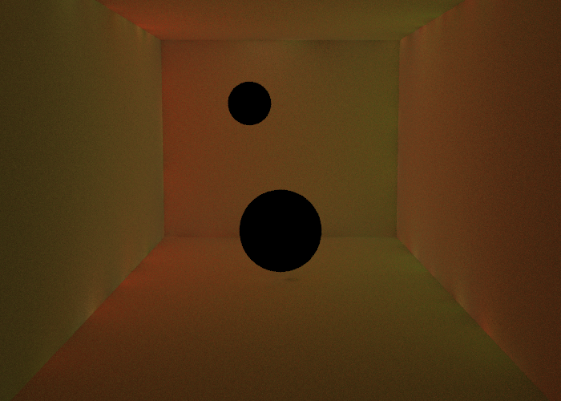

# photon_mapping_exp
参考書籍：青本(Realistic Image Synthesis Using Photon Mapping) http://graphics.ucsd.edu/~henrik/papers/book/  
参考: https://github.com/githole/simple-photonmap  
参考: https://www.slideshare.net/ssuser2848d3/ss-25795852  

## 手順紹介
書籍に紹介されていた「実践的な手法」をもとに実装しています。
- 集積光用フォトンマップを作成
- 間接光用フォトンマップを作成  
- 直接光をレイトレで、集積光、間接光の部分をフォトンマップを使った照度推定→輝度に→
- 直接光+間接光+集積光→出力

## 結果
直接光  
  
間接光  
  
集積光  
  

## 参考に
することは可能かもしれませんが、責任は持ちません......。
